# Git 사용법

### Git 이란?

- 형상 관리 시스템(Verson Control System)의 한 종류
- 컴퓨터 파일의 변경사항을 추적하고 여러명의 사용자들 간에 해당 파일들의 작업을 조율 하기 위한 **분산 버전 관리시스템** 이다.

---

### Git 용어

**repository**

- repository는 파일이나 디렉토리를 저장하는 장소이다.
- Git repository의 장점은 변경 이력이 존재하는 파일별로 구분되어 저장된다는 점이다.
- 저장소는 내 컴퓨터에 있는 로컬 저장소(local repository)와 전용 서버에서 관리되는 원격 저장소(remote repository)의 2개가 존재 한다.
- 기본적으로 로컬 저장소에서 작업을 진행하고 그 결과를 원격 저장소에 저장할 수 있다.

**branch**

- 브랜치란 독립적으로 어떤 작업을 진행하기 위한 개념이다.
- 필요에 의해 만들어지는 각각의 브랜치는 다른 브랜치의 영향을 받지 않기 때문에, 여러 작업을 동시에 진행할 수 있다.
- 여러 개의 브랜치는 다른 브랜치와 병합(Merge)함으로써 작업한 내용을 다시 새로운 하나의 브랜치로 모을 수 있다.

**commit**

- 파일을 추가하거나 변경사항을 저장소에 기록하기 위해 커밋 메시지를 남기는 작업을 말한다.
- 변경한 사람, 시간, 변경 내용 등을 기록해 과거 변경 이력과 내용을 손쉽게 파악 할 수 있다.

**add**

- 커밋하기 전에 **저장을 원하는 파일들을 묶는** 작업을 **스테이지에 파일을 올린다** 라고 한다.
- 줄여서 add라고 한다.

**push**

- 커밋을 하면 현재 작업 내용의 세이브 데이터가 내 컴퓨터에 저장된다.
- 이걸 github에 업로드하면 원격 저장과 비슷한 일을 한다.
- 다른 사람과 공유할 수 있고, 내 컴퓨터의 데이터가 날아가도 안전하게 다시 복구할 수 있다.
- github에 업로드 하는 것을 push 라고 한다.

**pull**

- 온라인 저장소의 버전이 로컬 저장소의 버전보다 높은경우, 온라인 저장소의 버전으로 로컬 저장소를 업데이트 하는 과정

**merge**

- 하나의 브랜치를 현재 브랜치와 합치는 것을 병합(marge)라고 한다.
- 현재 브랜치는 헤드(HEAD)브랜치라고 한다.
- 예를 들어 헤드 브랜치가 master이고 여기에 version2 브랜치를 변합하면 version2의 내용이 master에 반영 된다.

---

## 버전(Repository) 만들기

### 기본 개념

1. working directory
2. staging area
3. repository

### working directory

- 작업을 하는 프로젝트 디렉토리 (ex. MathTool)
- = working tree

### staging area

- git add를 한 파일이 존재하는 영역
- commit 을 하게되면 staging area에 있는 파일들만 commit에 반영됨
- = index (commit을 실행하기 전의 저장소와 working tree 사이에 존재하는 공간을 '인덱스' 라고 함)

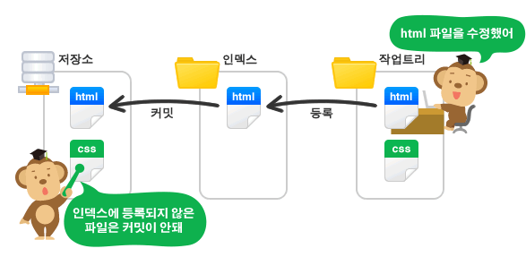</img>

### repository

- working directory의 변경 이력 들이 저장되어 있는 영역
- commit들이 저장되는 영역

### 정리

- git의 'commit' 작업은 'working tree'에 있는 변경 내용을 저장소에 바로 기록하는 것이 아니라 그사이 공간인 'index'에 파일 상태를 기록 (staging 한다고 표현)
- 따라서 저장소에 변경 사항을 기록하기 위해서는 기록하고자 하는 모든 변경 사항들이 'index'에 존재 해야 함
- 예를 들어 10개의 파일을 수정했지만 그 중에 7개만 저장소에 반영하고 싶을 때, 변경한 10개 파일 중 7개를 선택하는 작업이 바로 '인덱스에 등록' 또는 'staging'이라고 표현

### 연습

1. hello1.txt 파일 생성 (`nano hello1.txt` )

   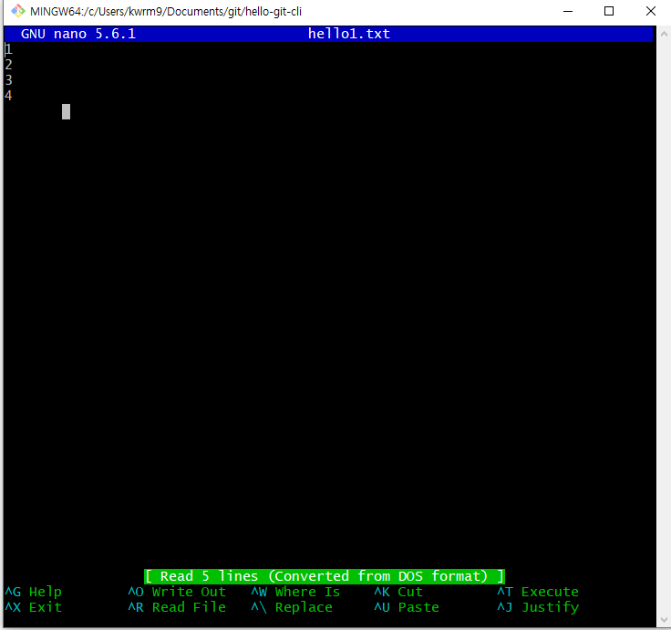</img>

2. 내용 입력
3. `ctrl + x ⇒ y ⇒ enter`
4. hello1.txt 파일 내용 확인 (`cat hello1.txt` )

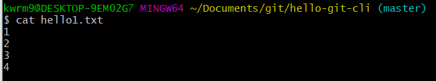</img>

5. 현재 상태 확인 ( `git status` )

   — No commits yet ( 현재 버전이 없음)

   — Untracked files ( 추적 되고 있지 않는 파일 )

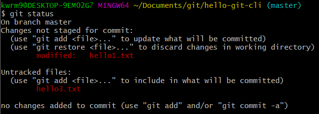</img>

6. staging area에 올리는 작업 (`git add hello1.txt`)

   — Changes to be committed (버전이 될 파일들을 보여줌 )

7. 버전을 생성 (`git commit -m " 커밋 메시지 "`)

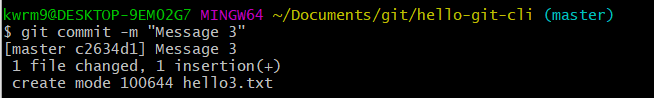</img>

8. 버전이 잘만들어 졌는지 확인 ( `git log` )

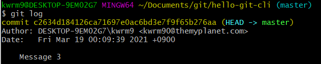</img>

---

## 버전삭제(Reset, Revert)

### Reset

- Reset은 돌아 가려는 커밋으로 리파지토리는 재설정되고, 해당 커밋 이후의 이력이 사라짐
- git reset <옵션> <돌아가고싶은 커밋>
- 옵션은 **hard**, **mixed**, **soft** 세가지가 있다.

  **(1) hard**

  - 돌아 가려는 이력 이후의 모든 내용을 지워 버린다.

  **(2) soft**

  - 돌아 가려 했던 이력으로 되돌아 갔지만, 이후의 내용이 지워지지 않고, 해당 내용의 인덱스(또는 스테이지)도 그대로 있다.
  - commit된 파일들을 stageing area로 돌려놓는다.
  - commit 하기 전 상태

  **(3) mixed (옵션을 적지 않으면 mixed로 동작)**

  - 돌아 가려 했던 이력으로 되돌아가고, 이후에 변경된 내용도 남아있지만, 인덱스는 초기화 된다.
  - 커밋 하려면 다시 변경된 내용은 추가해야 하는 상태

  ex)

  ```
  git reset --hard 358c1137f00978c7f905eb168852f25663701ca1
  ```

  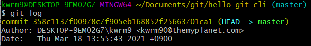</img>

  **Reset 사용 시 주의사항**

  - reset 명령을 통해 과거 커밋으로 이동하면서 그 이후 커밋은 삭제되어 되돌릴 수 없으므로 주의해야 한다.
  - 특히, 협업 시 push 후에는 다른 사람의 코드에 문제를 일으킬 소지가 있으므로 reset을 사용하지 않는다.

## Revert

- 이전 커밋 내역을 그대로 남겨둔 채 새로운 커밋을 생성한다.
- revert 기능은 특정 커밋을 되돌리는 작업도 하나의 커밋으로 간주하여 커밋 히스토리에 추가하는 방식이다.
- 즉, revert를 진행하면 `reset —soft` 또는`—mixed`와 동일한 결과를 갖지만 이력은 같지 않다.
- 따라서 다른 사람과 공유하는 브랜치에서 이전 커밋을 수정하고 싶으 때는 `revert`를 사용하는게 좋다.

## Revert 이해하기

1. 현재 상태

   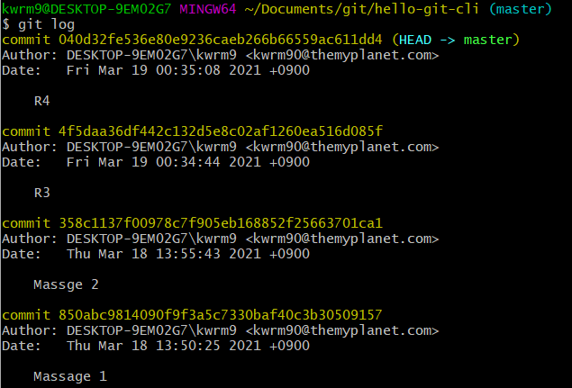</img>

2. 만약 R4를 삭제하고 R3 상태로 이동하고 싶다면
   - 만약 `reset`을 사용한해서 R3로 되돌린다면 R3의 commit id를 통해 R3 버전으로 이동하게 된다.

```
git reset -hard 4f5daa36df442c132d5e8c02af1260ea516d085f
```

- 하지만 `revert` 를 사용할 때에는 R3 가 아닌 R4를 `revert` 해줘야 R3로 되돌릴 수 있다.

3. `git revert (R4의 commit id)` 를 입력하면 에디터 화면으로 이동하게 된다.

   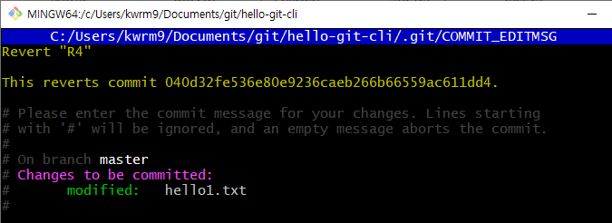</img>

4. 에디터를 빠져나온 후 (ctrl + x => y => enter) `git log`를 확인해 보면 새로운 commit 이 생기고 기존에 커밋도 유지 되있는 것을 확인 할 수 있다.

   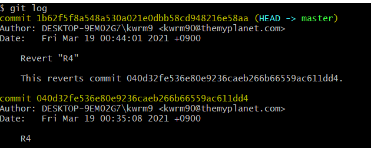</img>

   - 즉, 기존의 commit은 그대로 두고 기존 커밋에서의 변화를 취소 한 것이기 때문에 R4를 revert 하면 R3 상태로 돌아 가게 된다.

   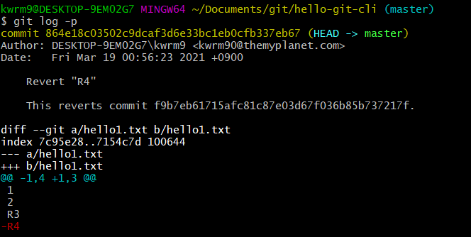</img>

---

## Branch 기본 사용법

### Branch 생성

1. `git branch` 명령어를 통해 브랜치 목록을 확인할 수 있다.

   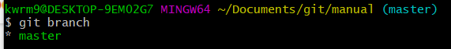</img>

2. `git branch apple` apple 이라는 이름의 브랜치를 생성한다.

   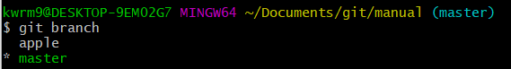</img>

3. `git checkout` 명령을 통해 브랜치를 이동할 수 있다.

```
git checkout appll
git checkout master
```

### 연습

1. `git checkout apple` 로 apple 브랜치로 이동
2. 에디터에서 apple 브랜치 내용을 수정 후 apple.txt 파일 생성 후 내용을 수정
3. add, commit 후 `git log --all --graph --oneline` 명령을 통해 브랜치를 그래프 처럼 확인 할 수 있다.

   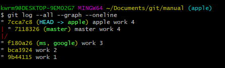</img>

   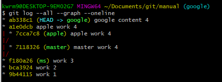</img>

### Merge

### (1) 서로다른 파일 병합

1. o2 브랜치 생성 `git branch o2`

2. master 브랜치로 이동 `git checkout master`

   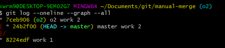</img>

3. o2 브랜치를 merge 하면 새로운 commit이 생성된다.

   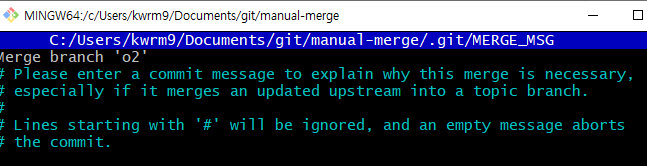</img>

   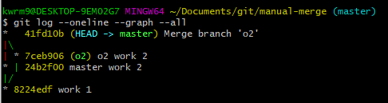</img>

### (2) 같은 파일 병합

1. 새로운 파일 work.txt 생성 `nano work.txt` 후 내용 입력

   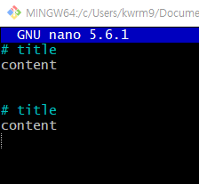</img>

2. 새로운 O2라는 새로운 branch 생성 `git branch O2`

3. master branch에서는 위쪽 content 내용을 master content로 수정

   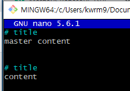</img>

4. O2 branch에서는 아래쪽 content 내용을 O2 content로 수정

   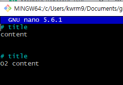</img>

   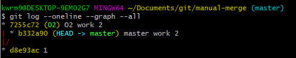</img>

5. 다시 master branch로 checkout한 다음 O2 branch를 master branch로 merge

   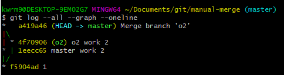</img>

   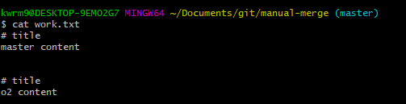</img>

---

### (3) 같은 파일, 같은 부분 변합 (conflict)

1. 현재 master 와 o2 branch가 현재 작업중인 로컬 브랜치를 가리키고 있다.

   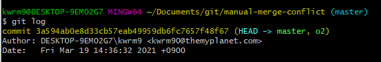</img>

2. master branch 에서는 중간에 master 내용을 추가

   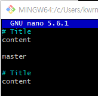</img>

3. o2 branch 에서는 중간에 o2 내용을 추가

   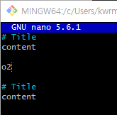</img>

   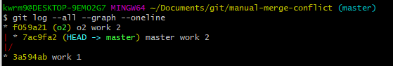</img>

4. 같은 파일에 같은 부분을 수정하고 merge를 하게 되면 conflict 발생

   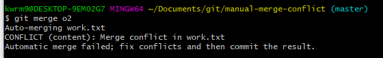</img>

   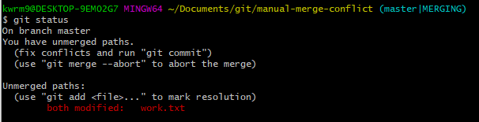</img>

5. `=======`는 구분자 이고 구분자 윗부븐은 현재 branch(master)를 나타내고 구분자 아래쪽은 o2 branch를 나타낸다.

- 이 상황은 git에서는 자동으로 처리할 수 없고 수동으로 수정 해줘야 한다.

  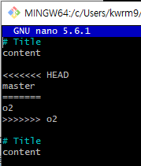</img>

6. 내용을 수정 후 add, commit을 해주면 conflict를 해결해서 수정했다는 메시지가 나온다.

   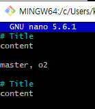</img>

   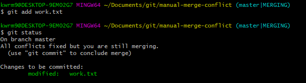</img>

   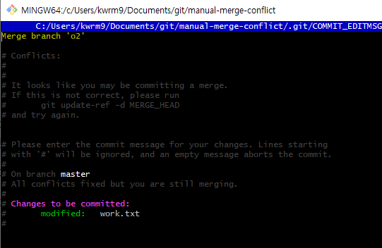</img>

7. `git log --all --graph --oneline` 명령을 통해 그래프로 표현하면 새로운 버전이 생성 된 걸 확인 할 수 있다

   - 이 새로운 버전은 o2의 최신 branch와 master의 이전 branch를 공통의 부모(base)로 하고 있다는 것을 확인 할 수 있다

   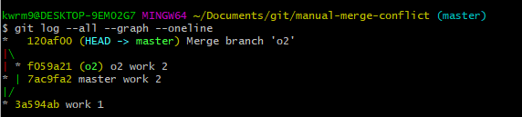</img>

8. 최종적으로 수정한 파일을 확인해 보면 conflict를 해결하고 수정 내용이 반영된 것을 확인할 수 있다.

   </img>

---

### Merge와 Rebase의 차이

- git 에서 특정 branch에서 다른 branch로 병합하는 방법은 Merge와 Rebase가 있다.
- Merge와 Rebase의 실행결과는 같지만 commit history가 달라진다.
- Merge는 쉽고 안전하지만 commit history가 지저분해 질 수 있다.
- 반면 Rebase는 잘 모르고 사용하면 위함하고 까다롭지만 commit history를 깔끔하게 관리 할 수 있다.
- Rebase는 base를 새롭게 설정한다는 의미로 이해하면 된다.

### Rebase

1. 현재 상황은 topic과 master각 각자 작업을 수행하는 상황

   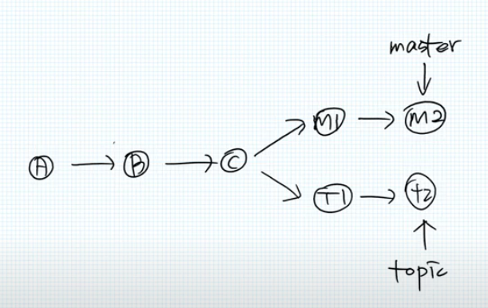</img>

2. 만약 topic 작업을 완료 한 후에 이어서 master 작업을 진행하려고 할때, 현재 master와 topic의 base는 `C` 이다.

   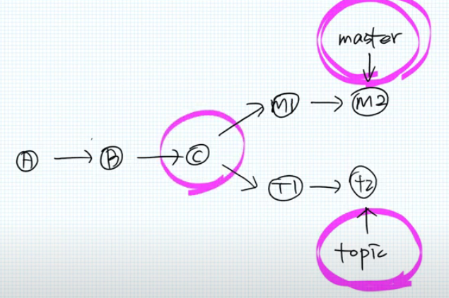</img>

3. 만약 master를 topic으로 rebase를 한다면 아래 그림 처럼 된다.

- master의 `m1`의 현재 base를 `C` 에서 topic의 `t2`로 rebase 한다.

  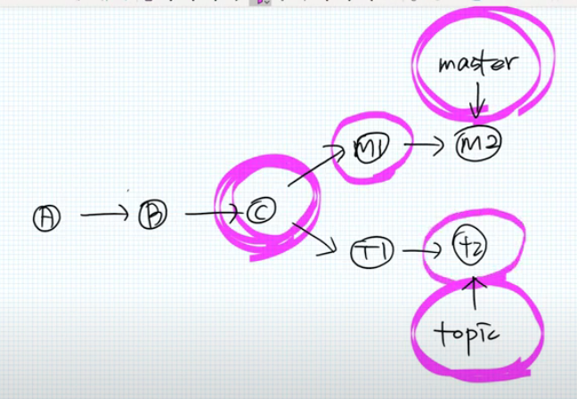</img>

  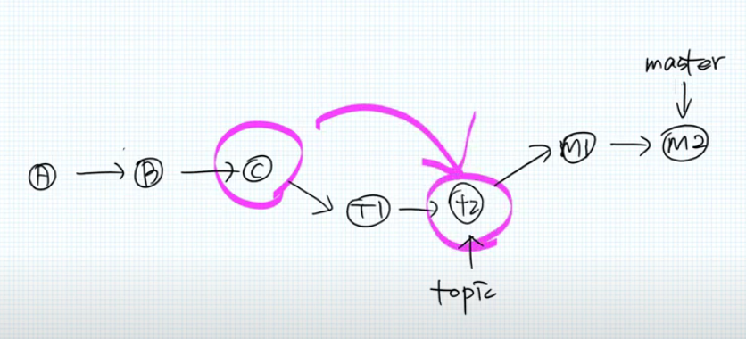</img>
